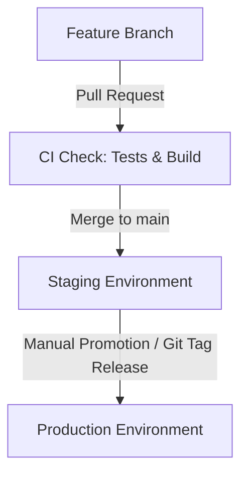

# HireIQ Environment Promotion & Deployment Guide

This document outlines the environment strategy, promotion pipeline, and staging configuration details for HireIQ.

## 1. Environment Topology

HireIQ runs two primary cloud environments:
1. **Staging**: Used for integration testing, QA, and pre-production validation.
2. **Production**: The live customer-facing application.

Both environments run matching tech stacks (FastAPI backend + React frontend + Celery/Redis + PostgreSQL).

---

## 2. Promotion Pipeline & CI/CD Workflow

### Step 1: Feature Work (Development)
- All development is conducted on feature branches.
- PRs targeting `main` automatically run test suites, linting, and build verification.

### Step 2: Auto-Deployment to Staging
- Merges or direct pushes to `main` automatically trigger the staging deployment workflow.
- GitHub Actions notifies the hosting environment (Render) via a secure webhook hook (`RENDER_STAGING_DEPLOY_HOOK`).

### Step 3: Staging Verification & QA
Before promoting changes to production, the following validations must be completed on Staging:
- **Stripe Integration**: Verify Stripe checkout sessions in Test Mode (using test card credentials).
- **Tenant Isolation**: Confirm multi-tenancy rules and Row-Level Security (RLS) on the Staging database.
- **Email Delivery**: Verify simulated/live transaction emails using Resend test API keys.

### Step 4: Promotion to Production (Manual)
- Production deployments are restricted and must be manually triggered.
- A new release tag (e.g. `v1.2.3`) is created or a manual workflow dispatch is triggered in GitHub Actions to promote the verified build from Staging to Production.

---

## 3. Staging Configuration Guidelines

Ensure the following environment variables are securely configured in your Staging environment:

| Variable Name | Purpose / Value |
| --- | --- |
| `ENVIRONMENT` | Set to `staging` |
| `DATABASE_URL` | Staging PostgreSQL connection URI |
| `STRIPE_SECRET_KEY` | Stripe Test Secret Key (`sk_test_...`) |
| `STRIPE_WEBHOOK_SECRET`| Stripe Webhook Signature Verification Secret |
| `RESEND_API_KEY` | Resend API Key for test email notification |
| `JWT_SECRET_KEY` | Cryptographically secure secret key for staging tokens |
| `FIELD_ENCRYPTION_KEY` | Fernet key for encrypting staging resume texts at rest |

---

## 4. Troubleshooting Staging Deployments

If a staging deploy fails:
1. **Logs**: Check the GitHub Actions logs for build step issues.
2. **Health Endpoints**: Access `https://staging-api.hireiq.com/health` to verify API and DB health.
3. **Webhook History**: Check the Stripe developer dashboard webhook delivery logs if subscription updates fail.
